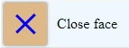

# hamburger-menu component


This is a hamburger-menu component. A standard custom web component written in pure vanilla JS, so it could be used in any framework.

> With the package you will find a complete functional example (**example.html, example.css, example.js**)<br>
> Please note that, as a developer, you do not need to take any action to control the menu itself, it works automatically as expected.

## Usage:
Use it like any standard tag:
- In html: `<hamburger-menu></hamburger-menu>`
- In JS: `document.createElement("hamburger-menu")`

## Attributes:
- `close-face`: if present `<hamburger-menu close-face></hamburger-menu>`, the menu shows 2 crossing bars instead of 3 parallel bars.

## Styling:
1. Define in an element's selector block one or more of the following custom properties:
   - `--dim`: menu dimensions in pixels. Default is 32px.
   - `--bg-color`: menu's background-color. Default is #ddd.
   - `--bars-color`: color of the menu's bars. Default is #555.
   - `--border-color`: color of the menu's borders and its box-shadow. Default is #c1c1c1.
   - `--border-radius`: radius of the menu's borders. Default is 0.25em.
   - `--transition-time`: when clicked, the menu transitions between open and close states. This custom property defines the transition time. Default is 200ms.
   ```css
   hamburger-menu { 
      --dim: 48px;
      --bars-color: blue;
   }
   ```

2. Or you can reach the following parts of the component:
   - `::part(menu)`: the menu is actually a `div` element, so style it as you style any `div` element.
   - `::part(bar)`: the bars inside the menu. Bars are actually `div`s elements, so style them as you style any `div` element.
   ```css
   ::part(menu) { background-color: lightgray; border-radius: 10px; }
   ```

## Events:
- `hamburger-menu-clicked`: This event enables developers to take actions when a user clicks the menu. To learn about the menu's state after the user clicks it, you should read `event.detail` which is a boolean value. If true that means the menu (after being clicked) has `close-face` attribute (which means it shows 2 crossed bars). Otherwise that means the menu has not `close-face` attribute and it shows 3 parallel bars.
   ```js
   document.querySelector("hamburger-menu")
      .addEventListener("hamburger-menu-clicked", e => { console.log(e.detail); });
   ```
